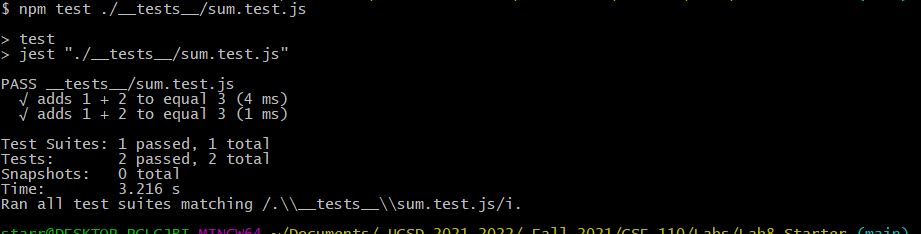
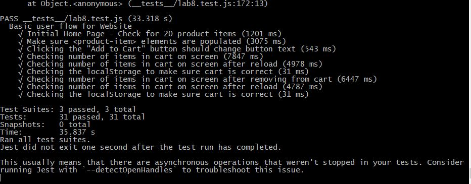

# Lab 8 - Starter
Lynn Dang

1. I would fit the automated tests for the Recipe project within a Github action that runs every time the code is pushed. This way it ensures that tests are run and working. It would be good to be able to manually run some locally just as a sanity check for the programmer, but the most important point is to run the tests before pushing the code into the main branch where it will be deployed.
2. An end to end test isn't really meant to check if a function is working properly. Rather, it emulates the user input and checks if different functions work together so that the web page displays the correct thing and the backend is working as expected.
3. I wouldn't use a unit test to test a "message" feature of a messaging application because this would involve multiple functions from taking in the input from the user to storing that message and then sending it to the other user and displaying it for them. This would be more of an E2E test.
4. A unit test could test the "max message length" as this would be a single function checking the text input box.

sum.test.js

unit.test.js

lab8.test.js
